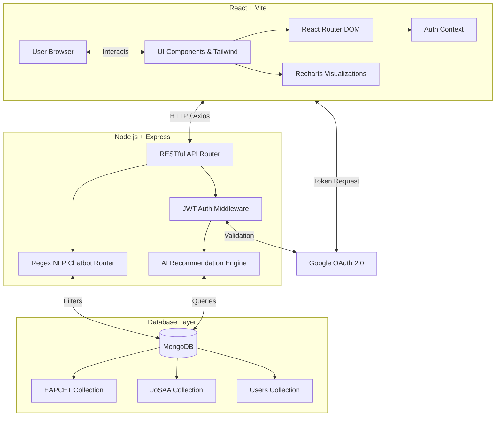

<div align="center">
  
  <h1>Path2Campus</h1>
  <p><strong>AI-Powered College Discovery & Decision Platform</strong></p>
  <p><em>Built for Aethronix 2026 Hackathon</em></p>
</div>

---

## 🏫 About The Project

Finding the right college is one of the most critical and stressful decisions a student has to make. There is a sea of data concerning ranks, cutoffs, quotas, and tuition fees scattered across multiple PDFs and portals, making it nearly impossible for a student to quickly gauge where they stand.

**Path2Campus** solves this problem. It is a full-stack, data-driven web application that aggregates real datasets (TG EAPCET 2024 and JoSAA 2024) to accurately predict college admissions based on a student's rank. By analyzing strict cutoffs, category reservations, and historical round-wise datasets, our AI-powered logic categorizes engineering colleges into **Safe**, **Target**, and **Dream** categories. 

The platform acts as a personalized admission counselor, computing admission probabilities, calculating estimated financial ROI based on fees, and providing side-by-side data comparisons to empower students to make the ultimate data-driven choice.

---

## 👥 Meet The Team

We are a team of passionate developers representing:
**Maturi Venkata Subba Rao Engineering College** 
*Hyderabad, Telangana*

* **Rakshitha Poshetty**
* **Nallari Ranga Sai Shivani**
* **Bommareddy Odithi Reddy**
* **Shenigaram Shreni**

---

## ✨ Core Features

* 🔐 **Secure 1-Click Login:** Integrated Google OAuth 2.0 for secure account generation to securely save your shortlisted colleges.
* 📊 **Dynamic Dataset Support:** Intercepts algorithms automatically based on user intent, cleanly swapping between **TG EAPCET** structures and **JoSAA/JEE** allocation structures.
* 🎯 **AI Admission Classifier:** Sophisticated probability logic evaluates your exact percentile/rank against deep category quotas, yielding `Safe`, `Target`, or `Dream` probabilities.
* ⚖️ **Side-by-Side Comparison Engine:** Choose exactly two distinct colleges and map them head-to-head across strict closing rank, probability, score, and tuition fee margins.
* 📉 **Interactive Analytics Dashboard:** See exactly how the market moves with dynamic Recharts implementations visually separating ROI distributions and JoSAA opening vs closing ranks.
* 🤖 **Natural Language ChatBot:** An embedded, context-aware AI assistant capable of parsing intent (e.g. *"Show me CSE colleges under 30k rank"*).

---

## 🏗️ Technical Architecture

Our system is a loosely coupled **MERN Stack** (MongoDB, Express, React, Node.js) implementation optimized for speed and scaling data ingestion.



### 💻 Technology Stack
* **Frontend:** React.js, Vite, Tailwind CSS v4, Lucide React (Icons), Recharts (Graphs), React Router DOM v6
* **Backend:** Node.js, Express.js, JSON Web Tokens (JWT), Google Auth Library
* **Database:** MongoDB (Mongoose Schema Modeling)
* **Data Pipelines:** Python/Node scripts parsing heavy `.xlsx` and `.csv` gov datasets

---

## 🧠 Recommendation Logic & Math
Our platform's brain functions on a strict distance ratio metric to ensure accurate probabilities.
1. **Distance Ratio:** `Ratio = (Closing_Rank - User_Rank) / Closing_Rank`
2. **Classification Logic:**
   - **Safe:** `Ratio > 0.20` *(Rank is vastly superior to the cutoff)*
   - **Target:** `-0.10 <= Ratio <= 0.20` *(Rank is right in the competitive window)*
   - **Dream:** `Ratio < -0.10` *(Rank relies heavily on sliding window variations)*
3. **Probability:** `Probability = Max(0, Min(100, Ratio * 100))`

---
Architecture Diagram


---

## 🚀 Installation & Running Locally

### Prerequisites
* Node.js (v20+)
* MongoDB (running locally on `mongodb://localhost:27017` or via MongoDB Atlas)

### Backend Setup
```bash
cd backend
npm install
# Ensure you copy .env.example to .env and set up your Google Client ID
npm run seed # This parses the CSVs and populates MongoDB
npm run dev # Servers on http://localhost:5000
```

### Frontend Setup
```bash
cd frontend
npm install
# Ensure you copy .env.example to .env and set up your Google Client ID
npm run dev # Servers on http://localhost:5174
```

> **Note:** The frontend application connects natively to `localhost:5000` via Axios proxying.

---

<div align="center">
  <em>Proudly designed and engineered by MVSR Engineering College.</em> 🎓
</div>
